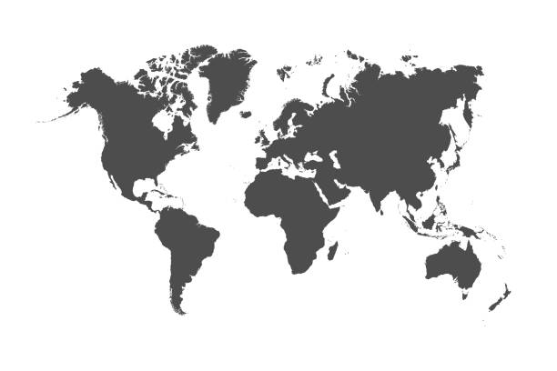

# Justin's User Page
### Created April 7th 2023

Hello, my name is Justin Ubamadu, I'm a **4th Year** majoring in *Cognitive Science* and minoring in *Computer Science*.I've lived in 5 countries, and hope to add more to the list in the future. 

As a programmer, I mainly use *Python* thought I have worked with *Java* and *C* in a limited capacity. 

***
## [Countries](assets/countries.md) I've Lived In 
 ***
- United States 
- Holland 
- Nigeria 
- Ethiopia 
- Kenya 
  

***
## Favorite IDEs 
***
1. [Visual Studio](https://visualstudio.microsoft.com/)
2. [IDLE *(Python)*](https://docs.python.org/3/library/idle.html)
3. [Netbeans *(Java IDE)*](https://netbeans.apache.org/)
4. [IntelliJ](https://www.jetbrains.com/idea/)
5. [Android Studio](https://developer.android.com/studio?gclid=Cj0KCQjwocShBhCOARIsAFVYq0hwDS3MrvbR7Xl4dCNjtSH4X8jiNXUlP7YCUt0eDok1S_lTVoTqgZoaAmInEALw_wcB&gclsrc=aw.ds)

***
### Goals for this Course
***
- [ ] Practice Working with Teams
- [ ] Learn what software engineers do in true workplaces
- [ ] Continue to Develop my soft skills
- [ ] Talk to the Professor about his experiences
- [ ] Learn to work better with `git commands` e.g: `git push`, `git pull`, `git branch`. 